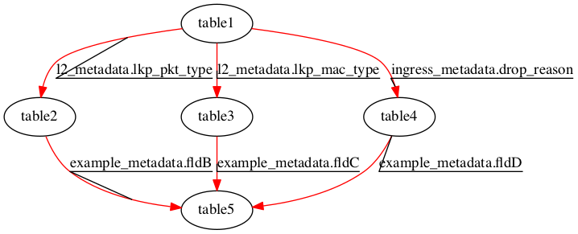
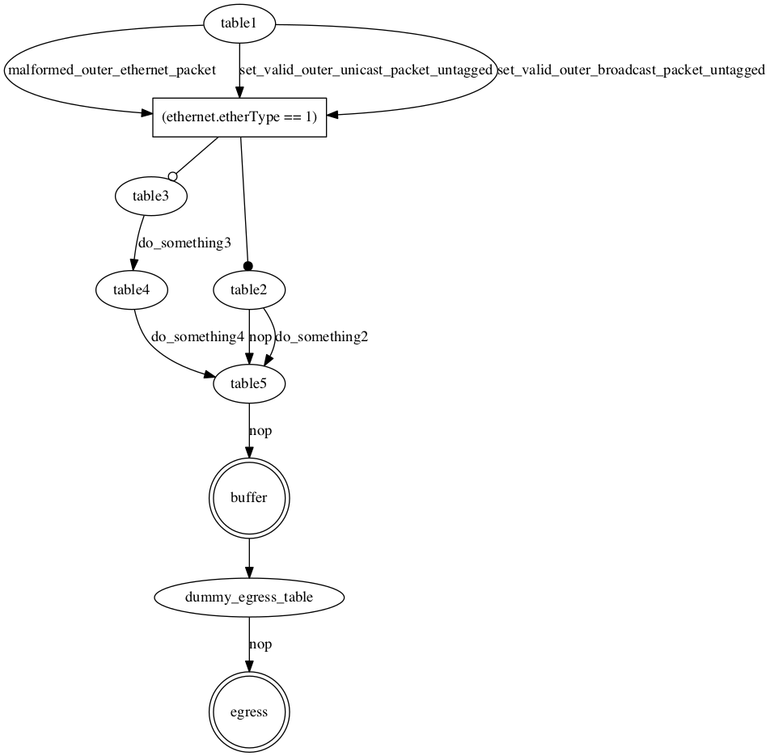
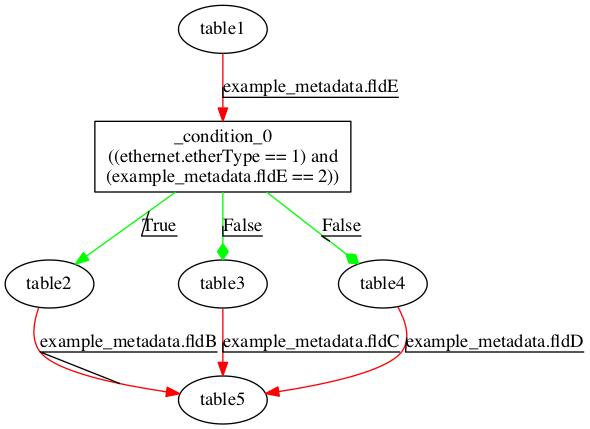
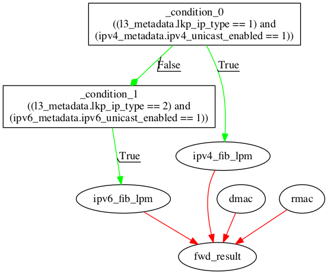
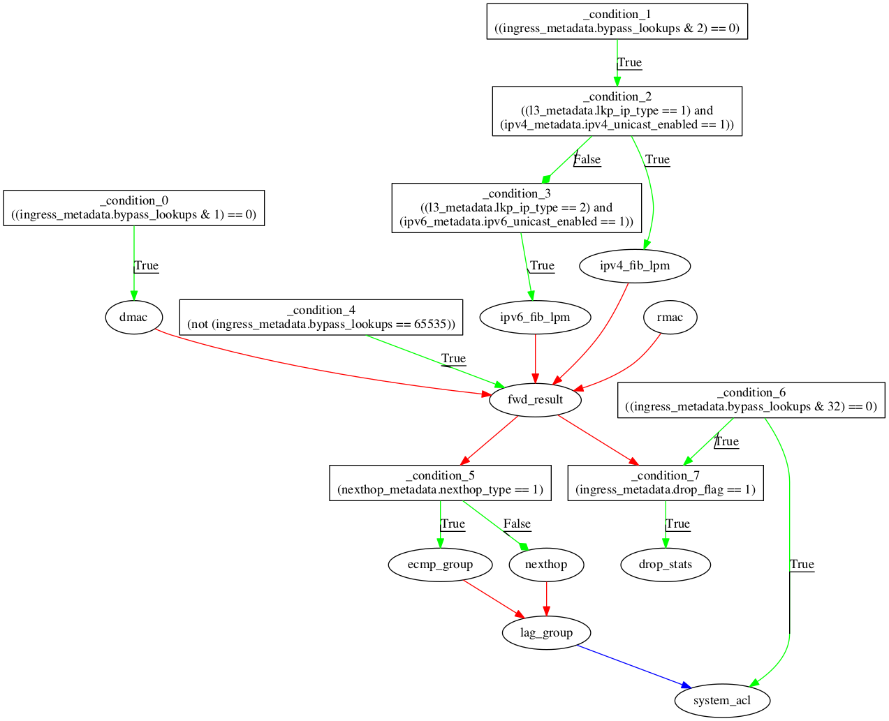
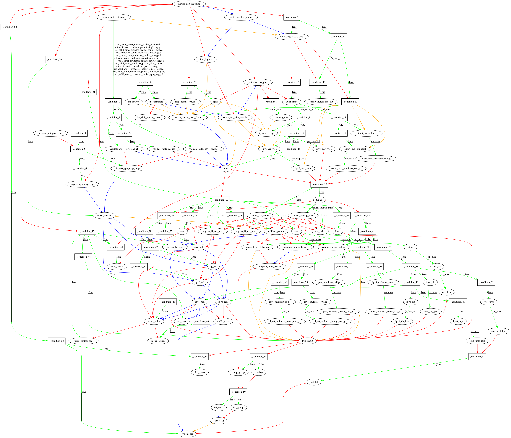

# `deps` - small artificial P4 programs demonstrating kinds of dependencies

The focus of all of these is on the ingress flow.  The egress flow is
there to satisfy the compiler, and only does a single no-op table
lookup.

## `deps1`

Ingress control block simply does 5 table apply actions sequentially.

Ingress control block source code: [v1.0.3/deps1/deps.p4#L117-L123](https://github.com/jafingerhut/p4lang-tests/blob/master/v1.0.3/deps1/deps.p4#L117-L123)

```
control ingress {
    apply(table1);
    apply(table2);
    apply(table3);
    apply(table4);
    apply(table5);
}
```

Table control flow graph: [v1.0.3/deps1/out/deps.tables.png](v1.0.3/deps1/out/deps.tables.png)


The table control flow graph shows table1 through table5 on ingress,
in that order, with one edge out of each table for each possible
result action type that the table can perform: 

Ingress table dependency graph: [v1.0.3/deps1/out/deps.ingress.tables_dep.png](v1.0.3/deps1/out/deps.ingress.tables_dep.png)



There are only red MATCH dependency edges in this graph.  As an
example, the edge from table1 to table2 is marked with the field
`l2_metadata.lkp_pkt_type`.  That is because this field is in the
search key for table2, and at least one action of table1 modifies that
field (e.g. the action
[`set_valid_outer_unicast_packet_untagged`](https://github.com/jafingerhut/p4lang-tests/blob/master/v1.0.3/deps1/deps.p4#L33)
of table1 does this).

There is _no_ conditional execution here.  All 5 table searches must
be performed, and the appropriate action for the result returned must
be performed.  table1's actions must complete before search keys can
be constructed for any of table2, table3, or table4, and all of their
actions must complete before table5's search key can be constructed.

The matches and actions for table2, table3, and table4 could be done
simultaneously, if the hardware is capable of doing so (e.g. if the
total number of search key bits is not too large, the total number of
result bits is not too large, the actions are simple enough that they
can all be done at the same time, etc.).


## `deps2`

The only difference between `deps1` and `deps2` is that in `deps2`,
the search keys for table2, table3, and table4 each have one less
field in them than they did in `deps1`, and the fields that have been
removed are ones that are written by actions for `table1`.

Thus the ingress control block source, and the table control flow
graph, are identical with `deps1`.

What changes is the table dependency graph, because now the search
keys for table2, table3, and table4 can be constructed without first
performing the action for table1.

Ingress table dependency graph: [v1.0.3/deps2/out/deps.ingress.tables_dep.png](v1.0.3/deps2/out/deps.ingress.tables_dep.png)


As for `deps1`, all 5 table matches and actions must be performed for
every packet.

In this case, the matches and actions for all of tables 1, 2, 3, and 4
could be done simultaneously, if the hardware is capable of doing so.
The critical path (ignoring hardware constraints) is shorter.


## `deps3`

The only change made from `deps2` to `deps3` is in the ingress control
block.  Now, after table1 is done, based upon the value of the header
field `ethernet.etherType`, either we apply table2, or we apply table3
then table4.

Ingress control block source code: [v1.0.3/deps3/deps.p4#L117-L126](https://github.com/jafingerhut/p4lang-tests/blob/master/v1.0.3/deps3/deps.p4#L117-L126)

```
control ingress {
    apply(table1);
    if (ethernet.etherType == 1) {
        apply(table2);
    } else {
        apply(table3);
        apply(table4);
    }
    apply(table5);
}
```

The table control flow graph reflects this conditional execution, but
as always also reflects the source code sequential order, which is
usually more restrictive than the table dependency graph.

Table control flow graph: [v1.0.3/deps3/out/deps.tables.png](v1.0.3/deps3/out/deps.tables.png)



The table dependency graph is the same as before, except for the
addition of a condition node, with green SUCCESSOR dependencies to
table2 labeled True, and to table3 and table4 labeled False.

Ingress table dependency graph: [v1.0.3/deps3/out/deps.ingress.tables_dep.png](v1.0.3/deps3/out/deps.ingress.tables_dep.png)


Note that as for `deps2`, table3 and table4 can be executed
simultaneously.

There is still no dependency out of table1, except to table5, because
table1 cannot modify the field in the condition.

With condition nodes, we get into an extra level of detail on what
execution orders are possible.

In this example, doing the match for table2, table3, or table4 does
not cause any side effects, i.e. no metadata or packet headers are
changed merely by doing the match (the actions can, but not the
match).

Thus a correct execution order would be to construct and 'launch' the
search keys for all of table1 through table4 as soon as we start
processing the packet, before even evaluating the condition.  As long
as the only side effects performed are the ones for the appropriate
True or False branch of the condition, the worst that can happen from
doing extra matches is the extra hardware resources that might be
used, e.g. extra search keys constructed and launched unnecessarily,
extra power used, etc.  Doing such speculative key construction and
launching might lead to a shorter execution schedule.

Another correct execution order would be to only launch the search
keys required for the branches actually taken.  Depending upon the
hardware, this might increase the latency from start to finish for
processing a packet.

Aside: P4 allows one to create tables that have side effects that
should happen simply due to matches being performed, e.g. you may
create a `counter` or `meter` object with the P4 `direct` keyword,
naming a table to which those counters are meters have a one-for-one
relationship, and are automatically updated when a search of the table
results in a match of an entry.

If we added per-entry match counters to table2, for example, then
there would only be 2 correct ways to implement this that I can think
of:

* Only launch table2's search key if the condition is evaluated as
  True.  This launching would cause the necessary counter update to
  occur as a side effect, in addition to returning the match result.

* Speculatively launch table2's search key before evaluating the
  condition.  Later, after evaluating the condition, if it is True and
  thus table2's action should be performed, cause the appropriate
  match counter to be updated.  This separate action to update the
  match counter might require 'launching' a separate table update
  command to a counter table, for example.

That feature is not used in this `deps3` source code, so this issue
does not arise, but it is worth keeping in mind for a fully featured
correct P4 compiler.


## `deps4`

The only change from `deps3` is that the condition has been extended
to include a field `example_metadata.fldE` that is modified by an
action of table1.

```
control ingress {
    apply(table1);
    if ((ethernet.etherType == 1) and (example_metadata.fldE == 2)) {
        apply(table2);
    } else {
        apply(table3);
        apply(table4);
    }
    apply(table5);
}
```

The table control flow graph is the same as for `deps3`, except for
the contents of the condition, of course.

The table dependency graph changes so there is a red MATCH dependency
from table1 to the condition.

Ingress table dependency graph: [v1.0.3/deps4/out/deps.ingress.tables_dep.png](v1.0.3/deps4/out/deps.ingress.tables_dep.png)



We could still simultaneously launch search keys for table1 through
table4 if the hardware can support it, as long as only the side
effects of table2's action is performed if the condition evaluates to
True, or only the side effects of table3 and table4's actions are
performed if the condition evaluates to False.  Note that in general
you will not know the value of the condition until after table1's
action is finished (or finished enough that you know what value it
will assign to the field `example_metadata.fldE`).


# `switch-subset` - small subsets of switch.p4


## `switch-subset1`

`switch-subset1` has an ingress control block that is a very small
subset of switch.p4's.

```
control ingress {
    process_mac();  /* control block congaining only apply(dmac) */
    apply(rmac) {
        default {
            if ((l3_metadata.lkp_ip_type == IPTYPE_IPV4) and
                (ipv4_metadata.ipv4_unicast_enabled == TRUE)) {
                process_ipv4_fib();   /* only does apply(ipv4_fib_lpm) */
            } else {
                if ((l3_metadata.lkp_ip_type == IPTYPE_IPV6) and
                    (ipv6_metadata.ipv6_unicast_enabled == TRUE)) {
                    process_ipv6_fib();  /* only does apply(ipv6_fib_lpm) */
                }
            }
        }
    }
    process_fwd_results();  /* only does apply(fwd_result) */
}
```

The table dependency graph of this small subset is fairly similar to
`deps4`.

Ingress table dependency graph: [v1.0.3/switch-subset1/out/switch.ingress.tables_dep.png](v1.0.3/switch-subset1/out/switch.ingress.tables_dep.png)




## `switch-subset2`

`switch-subset2` includes everything that `switch-subset1` does, plus
more conditions and tables after table `fwd_result`, which depend upon
the actions of `fwd_result`.

Ingress table dependency graph: [v1.0.3/switch-subset2/out/switch.ingress.tables_dep.png](v1.0.3/switch-subset2/out/switch.ingress.tables_dep.png)




This is the first example to demonstrate a conditional branching
behavior which is not uncommon within switch.p4, and I suspect most
useful P4 programs.  Note that there is an early branch where at most
one of tables ipv4_fib_lpm and ipv6_fib_lpm need to be done (as
mentioned earlier, both matches could be done speculatively, as long
as only the side effects of the taken branch are performed).

After that, both paths should apply table fwd_result.  Then there is
another conditional branch that depends upon a field modified by the
action of fwd_result.  The table ecmp_group is applied in one branch,
table nexthop in the other.

The direction taken by the second branch is _independent_ of the
direction taken by the first.  The first depends on whether the packet
is IPv4 or IPv6.  The second depends on whether the longest prefix
match gave a route with multiple equal cost paths (ecmp_group), or
not.

Thus if one wants to minimize the matches done, there are 4
possibilities: 1st and 2nd conditions are both true, 1st true and 2nd
false, 1st false and 2nd true, or 1st and 2nd both false.

See [this README](v1.0.3/switch-orig/README-conditions.md) for the
meaning of many of the conditions you will see in switch.p4 table
dependency graphs.


## `switch-subset3`

`switch-subset3` includes everything that `switch-subset2` does, plus
more.


Ingress table dependency graph: [v1.0.3/switch-subset3/out/switch.ingress.tables_dep.png](v1.0.3/switch-subset3/out/switch.ingress.tables_dep.png)


Note that there are green SUCCESSOR dependency edges out of table rmac
at the top.  The labels `rmac_miss` and `rmac_hit` are 2 different
result types that the table rmac can return as a search result.  These
are like `if` conditions `(table rmac returned result type ==
rmac_miss)` and `(table rmac returned result type == rmac_hit)`.  Like
the True and False branches of an `if` condition, they are mutually
exclusive -- only the side effects of the taken branch should be
performed.  Table matches that have no side effects may be done
speculatively, as for `if` conditions.

From the beginning up to table fwd_result, there are the following
distinct paths possible:

* rmac_miss, condition_1 True causes both tables ipv4_multicast_bridge
  and ipv4_multicast_route to be applied (at least possibly, depending
  on other conditions)

* rmac_miss, condition_1 False may cause both tables
  ipv6_multicast_bridge and ipv6_multicast_route to be applied.

* rmac_hit, condition_8 True may cause ipv4_fib_lpm

* rmac_hit, condition_8 False may cause ipv6_fib_lpm

Those 4 possible paths are multiplied by 2 because of the 2 paths
possible out of condition_11.


## `switch-orig`

I have not tried to count the number of possible mutually exclusive
paths through the full switch.p4 ingress control block, but you can
look at it here.  This graph has been generated leaving out the
contents of the conditions, to keep it somewhat more readable.  Some
of the conditions are identical to each other, or contain common
sub-conditions, and thus not independent of each other.

Ingress table dependency graph: [v1.0.3/switch-orig/out1-unchanged/switch.ingress.tables_dep.png](v1.0.3/switch-orig/out1-unchanged/switch.ingress.tables_dep.png)


