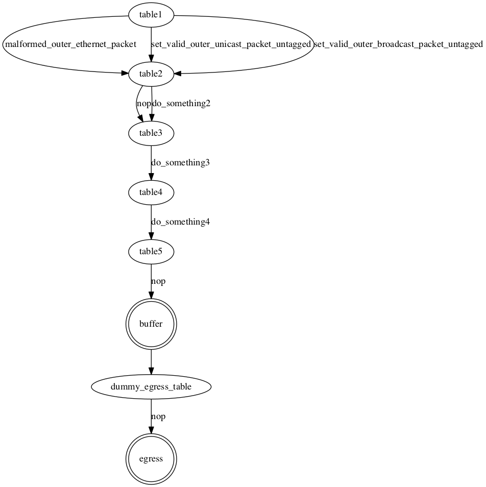

# `deps` - small artificial P4 programs demonstrating kinds of dependencies

The focus of all of these is on the ingress flow.  The egress flow is
there to satisfy the compiler, and only does a single no-op table
lookup.

## `deps1`

Ingress control block simply does 5 table apply actions sequentially.

Ingress control block source code: [v1.0.3/deps1/deps.p4#L117-L123](https://github.com/jafingerhut/p4lang-tests/blob/master/v1.0.3/deps1/deps.p4#L117-L123)

Table control flow graph: [v1.0.3/deps1/out/deps.tables.png](v1.0.3/deps1/out/deps.tables.png)

The table control flow graph shows table1 through table5 on ingress,
in that order, with one edge out of each table for each possible
result action type that the table can perform: 

Ingress table dependency graph: [v1.0.3/deps1/out/deps.ingress.tables_dep.png](v1.0.3/deps1/out/deps.ingress.tables_dep.png)

There are only red MATCH dependency edges in this graph.  As an
example, the edge from table1 to table2 is marked with the field
`l2_metadata.lkp_pkt_type`.  That is because this field is in the
search key for table2, and at least one action of table1 modifies that
field (e.g. the action
[`set_valid_outer_unicast_packet_untagged`](https://github.com/jafingerhut/p4lang-tests/blob/master/v1.0.3/deps1/deps.p4#L33)
of table1 does this).

There is _no_ conditional execution here.  All 5 table searches must
be performed, and the appropriate action for the result returned must
be performed.  table1's actions must complete before search keys can
be constructed for any of table2, table3, or table4, and all of their
actions must complete before table5's search key can be constructed.

The matches and actions for table2, table3, and table4 could be done
simultaneously, if the hardware is capable of doing so (e.g. if the
total number of search key bits is not too large, the total number of
result bits is not too large, the actions are simple enough that they
can all be done at the same time, etc.).

## `deps2`

The only difference between `deps1` and `deps2` is that in `deps2`,
the search keys for table2, table3, and table4 each have one less
field in them than they did in `deps1`, and the fields that have been
removed are ones that are written by actions for `table1`.

Thus the ingress control block source, and the table control flow
graph, are identical with `deps1`.

What changes is the table dependency graph, because now the search
keys for table2, table3, and table4 can be constructed without first
performing the action for table1.

Ingress table dependency graph: [v1.0.3/deps2/out/deps.ingress.tables_dep.png](v1.0.3/deps2/out/deps.ingress.tables_dep.png)

As for `deps1`, all 5 table matches and actions must be performed for
every packet.

In this case, the matches and actions for all of tables 1, 2, 3, and 4
could be done simultaneously, if the hardware is capable of doing so.
The critical path (ignoring hardware constraints) is shorter.

# `switch-subset` - small subsets of switch.p4
